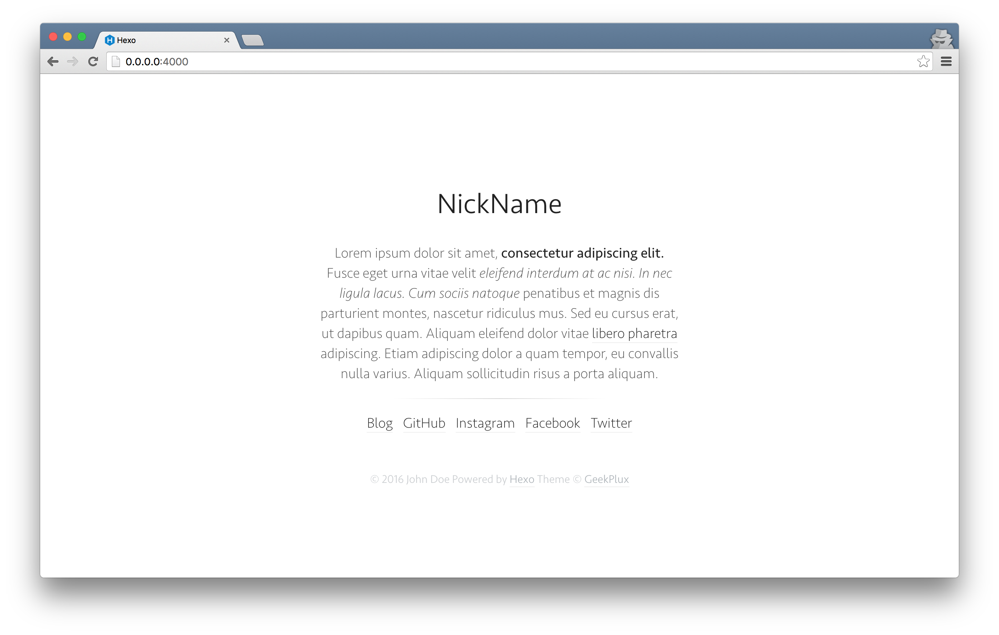

# Typing

a pure and fresh Hexo theme. (WIP)


## Preview

[Demo](demo)




## Installation

### Install

    WIP

**Typing requires Hexo 2.4 and above.**

### Enable

Modify `theme` setting in `_config.yml` to `typing`.

### Update

``` bash
cd themes/typing
git pull
```

## Configuration

``` yml
# Header
menu:
  Home: /
  Archives: /archives
rss: /atom.xml

# Content
fancybox: true

# Miscellaneous
google_analytics:
favicon: /favicon.png
twitter:
google_plus:
```

- **menu** - Navigation menu
- **rss** - RSS link
- **fancybox** - Enable [Fancybox]
- **google_analytics** - Google Analytics ID
- **favicon** - Favicon path
- **twitter** - Twiiter ID
- **google_plus** - Google+ ID


## Development

```shell
fork & clone
npm install
makefile
```

### LICENSE

MIT &copy; [GeekPlux](https://github.com/geekplux)
