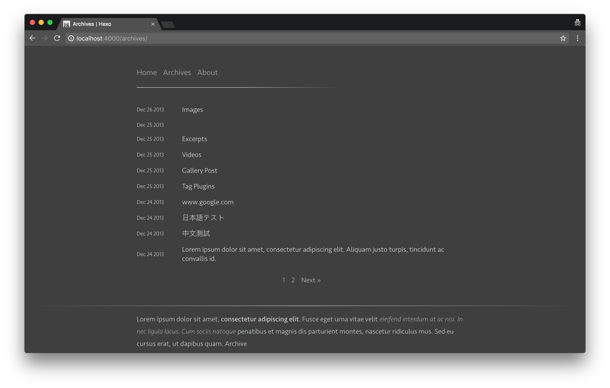

# Typing

> A pure and fresh Hexo theme.

* Minimal And Clean Design
* Dark And Light Modes
* Optional Fontawesome Icons

## Preview

- [My blog](http://geekplux.com)
- [Online Demo](http://geekplux.github.io/hexo-theme-typing/)


##### Dark mode



Other preview images in `preview` folder.

## Installation

### Install

```shell
cd your-blog
git clone https://github.com/geekplux/hexo-theme-typing themes/typing
```

**Typing requires Hexo 2.4 and above.**

### Enable

Modify `theme` setting in `_config.yml` to `typing`.

Also if your website language is English make sure to explicitly specify it: `language: "en"`

### Update

``` bash
cd themes/typing
git pull
```

## Configuration

``` yml
# Dark Mode
dark: false // whether to open dark mode

# Header
menu:
  Home: /
  Archives: /archives

# Your Feed Location
#rss: /atom.xml

# Content
fancybox: true

# Display a "Read More" link under each post's excerpt in /archives page
#excerpt_link: 'Read More'

# Miscellaneous
google_analytics:
favicon: /favicon.png
twitter:
google_plus:

# Profile
nickname: NickName
description: Lorem ipsum dolor sit amet, **consectetur adipiscing elit.** Fusce eget urna vitae velit *eleifend interdum at ac* nisi.

# Load forkawesome icons? Also see the links option
icons: true

# Footer area links
# NOTICE) If you set "icons: false" link names will be clear text
# If "icons: true" link names will interpreted as forkawesome icon names
# NOTICE) Use the forkawesome icon names (https://forkaweso.me/Fork-Awesome/icons/) without the fa- prefix
links:
  twitter: https://twitter.com/
  github-alt: https://github.com/
# ...

# nav position (top, left. top is default)
nav: top

# Info
archive_footer_content: Lorem ipsum dolor sit amet, **consectetur adipiscing elit.** Fusce eget urna vitae velit *eleifend interdum at ac* nisi.
post_footer_content: ipsum dolor sit amet, **consectetur adipiscing elit.** Fusce eget urna vitae velit *eleifend interdum at ac* nisi.

# Gitment
gitment:
  owner:
  repo:
  client:
    id:
    secret:

# Donate
donate:
  github:
  paypal:
  bitcoin:
  BTCQR:
  AliPayQR:
  WeChatQR:
```

- **menu** - Navigation menu
- **nickname** - Your nickname
- **description** - Description below the name
- **icons** - Load [fontawesome](http://fontawesome.io/) icons?
- **links** - Footer area links. Text links if `icons: false` and icons if `icons: true`
- **archive_footer_content**: - Content in your archives page footer(Markdown supported)
- **post_footer_content**: - Content in your posts and pages footer(Markdown supported)
- **fancybox** - Enable [Fancybox]
- **google_analytics** - Google Analytics ID
- **favicon** - Favicon path
- **twitter** - Twitter ID
- **google_plus** - Google+ ID
- **gitment** - [Gitment](https://github.com/imsun/gitment) Options
- **donate** - Donate Options


## ChangeLog

- [CHANGELOG](CHANGELOG.md)

## Development

Anyone is welcome to contribute!

```shell
mkdir typing_dev && cd typing_dev
git clone https://github.com/hexojs/hexo-theme-unit-test.git
```
[Fork and clone](https://help.github.com/articles/fork-a-repo/) `https://github.com/geekplux/hexo-theme-typing.git`
```shell
cd hexo-theme-unit-test && npm install
cd ../hexo-theme-typing && npm install
```
To test your changes to the theme, modify the `theme` setting in the
`/hexo-theme-unit-test/_config.yml` file to `typing` and
execute these commands in the `hexo-theme-typing` folder:
```shell
make all
cd ../hexo-theme-unit-test
hexo server
```
Now you can browse it at [127.0.0.1:4000](http://127.0.0.1:4000/)


### LICENSE

Typing © [@geekplux](https://github.com/geekplux), Released under the [MIT](LICENSE) License.

Authored and maintained by [@geekplux](https://github.com/geekplux) with help from contributors ([list](https://github.com/geekplux/hexo-theme-typing/graphs/contributors)).

---

> Blog [geekplux.com](http://geekplux.com) &nbsp;&middot;&nbsp;
> GitHub [@geekplux](https://github.com/geekplux) &nbsp;&middot;&nbsp;
> Twitter [@geekplux](https://twitter.com/geekplux)
